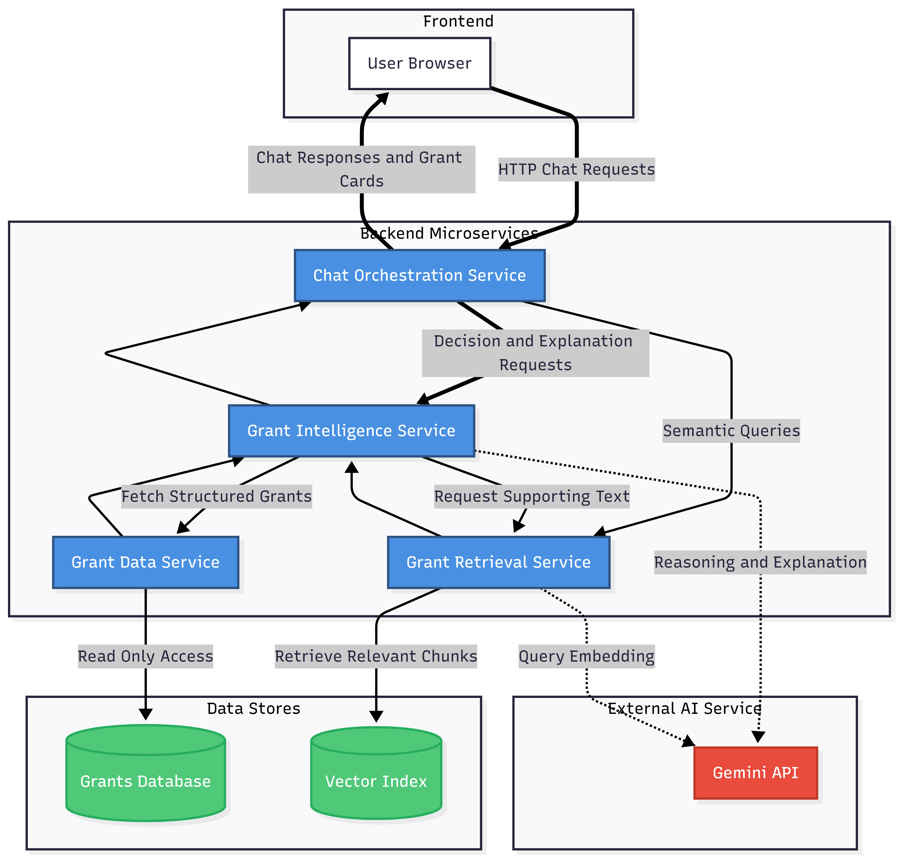
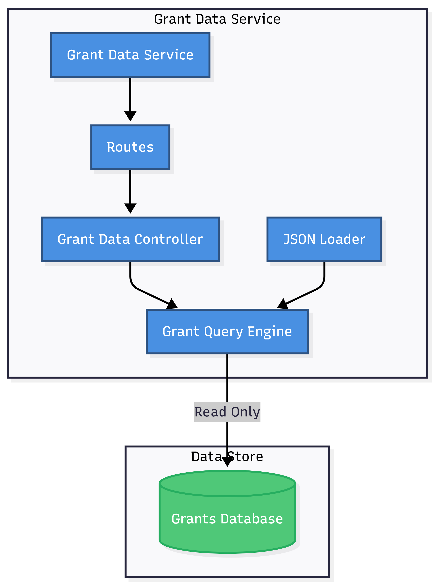
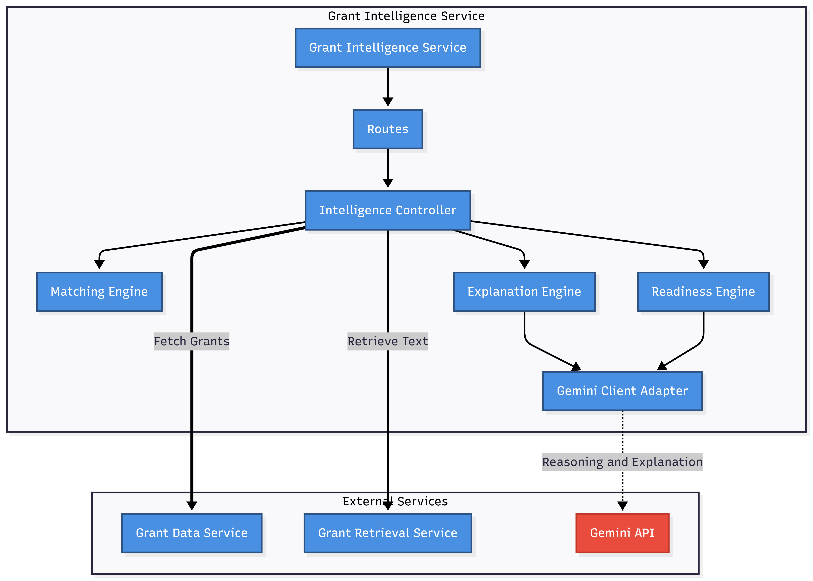
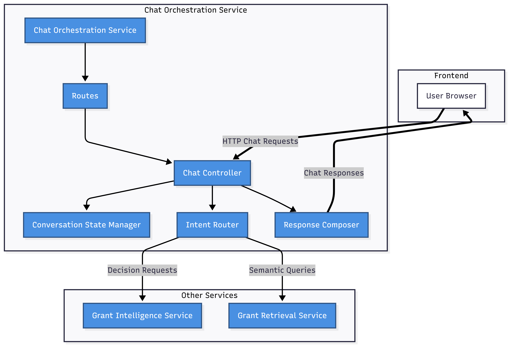
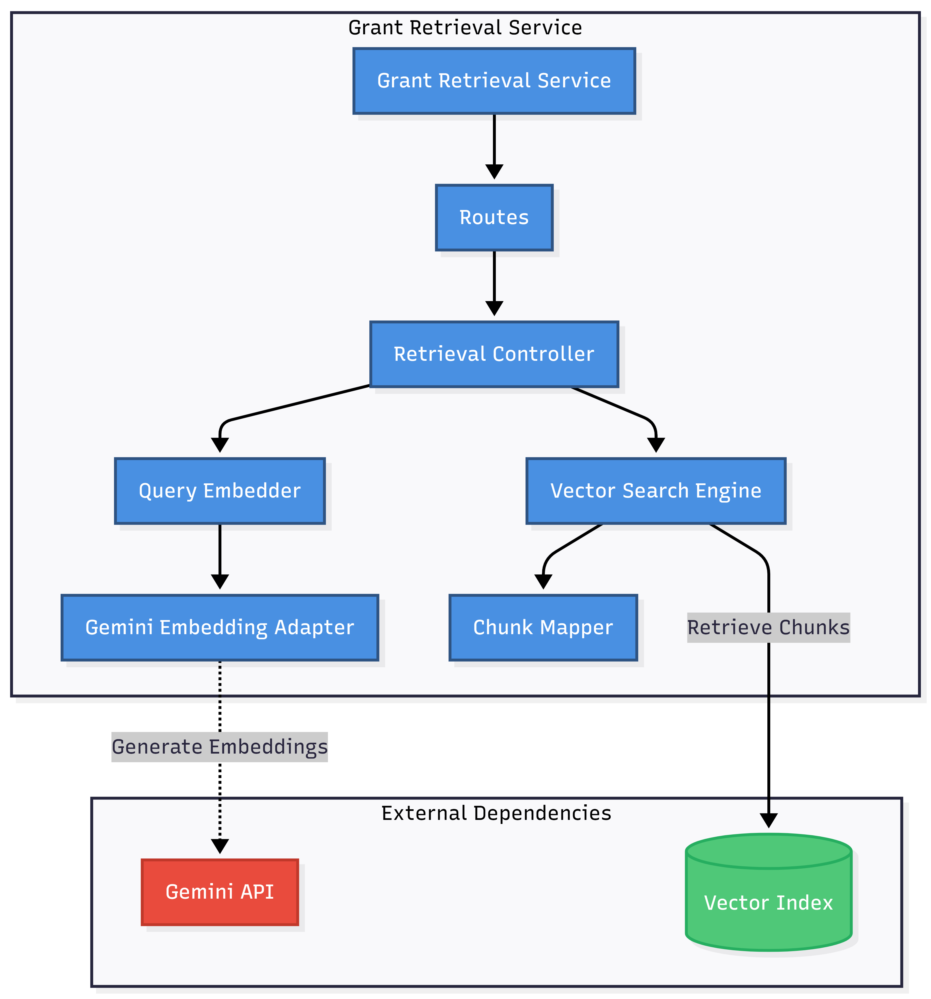

# Backend Architecture Overview

This section documents the **backend architecture** of our application.  
The goal is to clearly explain **how the system is structured**, **why each component exists**, and **how they work together** to support the user use cases.

We intentionally present the architecture at **two levels**:

1. A **high-level system view** (how all services interact)
2. **Per-microservice views** (what each service is responsible for internally)

---

## Design Principles

The backend architecture is guided by the following principles:

- **Microservice architecture**
- **Single source of truth**
- **Deterministic logic first**
- **Explainability over magic**
- **Read-only data assumption**

---

## Services Overview

The backend consists of **four microservices**:

1. **Chat Orchestration Service**  
   Manages conversation flow, user context, and request routing.

2. **Grant Intelligence Service**  
   The decision-making brain: matching grants, explaining them, and generating application readiness guidance.

3. **Grant Retrieval Service**  
   Provides semantic search over grant text using a vector index.

4. **Grant Data Service**  
   Read-only source of truth backed by the **Grants Database**.

An external **Gemini API** is used in a controlled manner for reasoning and embeddings.

---

## High-Level Backend Architecture

This diagram provides a **system-wide view** of how the frontend, backend microservices, data stores, and external AI services interact.

### Rationale

- Clearly separates frontend, backend services, data stores, and external AI
- Prevents AI services from bypassing business logic
- Makes service responsibilities and data ownership explicit

---

## Grant Data Service

The **Grant Data Service** acts as the **single source of truth** for all structured grant data.

### Rationale

- Provides consistent, read-only access to grant data
- Prevents accidental data mutation
- Keeps other services stateless and focused on logic

---

## Grant Intelligence Service

The **Grant Intelligence Service** is the **core decision-making engine** of the system.

### Rationale

- Centralises all grant decision logic in one service
- Combines deterministic matching with AI-assisted explanation
- Produces transparent outputs:  
  _why a grant matches, why it does not, and what to prepare_

---

## Diagram 4: Chat Orchestration Service

The **Chat Orchestration Service** manages conversation flow and service coordination.

### Rationale

- Keeps conversational logic separate from grant logic
- Routes user requests to the appropriate backend service
- Aggregates responses into chat-friendly outputs (messages + grant cards)

---

## Grant Retrieval Service

The **Grant Retrieval Service** provides semantic search capabilities over grant text.

### Rationale

- Isolates probabilistic AI behaviour (embeddings, semantic search)
- Enables natural-language discovery and follow-up questions
- Prevents LLM-driven logic from leaking into matching decisions
